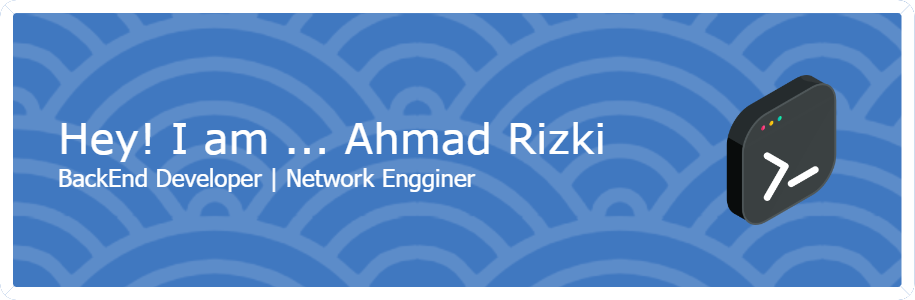

# 💫 About Me:
👋 Hi there, I'm Ahmad Rizki! 🛠️ I’m a passionate Back-End Developer & Network Engineer with a strong love for clean code and solid infrastructure. 🏢 Currently working at a private company specializing in Network Infrastructure Solutions — making systems smarter, faster, and more reliable. 🌐 I thrive on connecting backend logic with robust networking to bring seamless digital experiences to life.  🔧 What I’m up to: 🎯 Building and optimizing scalable backend systems 🧠 Diving deeper into cloud networking & automation 🤝 Open for collaboration on impactful tech projects  💬 Fun Side of Me: ⚽ Love kicking the ball on weekends 🎣 Find peace while fishing — my natural debugger 😉

## 🌐 Socials:
   

# 💻 Tech Stack:
                       
# 📊 GitHub Stats:
 
 

## 🏆 GitHub Trophies

### 🔝 Top Contributed Repo

---

<!-- Proudly created with GPRM ( https://gprm.itsvg.in ) -->

